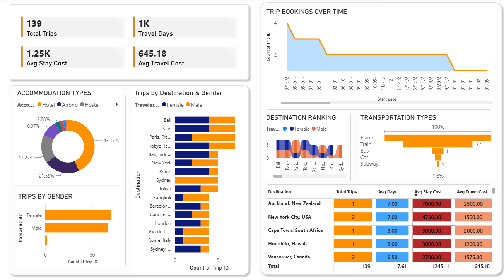

# Travel & Booking Analytics Dashboard



## Project Overview

This project analyzes travel booking data using **MySQL** and **Power BI** to generate meaningful business insights. The dashboard helps understand travel trends, destination popularity, accommodation preferences, transportation choices, travel costs, and traveler demographics.

---

## Tools & Technologies

* MySQL
* SQL
* Power BI
* Microsoft Excel

---

## Dataset Information

The dataset contains **139 travel booking records** with the following attributes:

* Trip ID
* Destination
* Start Date
* End Date
* Duration (Days)
* Traveler Name
* Traveler Age
* Traveler Gender
* Traveler Nationality
* Accommodation Type
* Accommodation Cost
* Transportation Type
* Transportation Cost

---

## SQL Concepts Used

* SELECT
* WHERE
* ORDER BY
* GROUP BY
* Aggregate Functions (COUNT, AVG)
* Views
* Stored Procedures

---

## Analytics Performed

### Query Analysis

* Total Trips Analysis
* Average Trip Duration Analysis
* Top Destinations Analysis
* Traveler Gender Distribution Analysis
* Traveler Nationality Analysis
* Average Traveler Age Analysis

### Views

* Accommodation Analysis
* Destination Cost Analysis
* Transportation Analysis
* Traveler Demographics

### Stored Procedures

* GetAccommodationReport()
* GetDestinationReport()
* GetTransportationReport()
* GetTravelerDemographics()

---

## Power BI Dashboard Features

### KPI Cards

* Total Trips
* Travel Days
* Average Stay Cost
* Average Travel Cost

### Visualizations

* Accommodation Type Distribution
* Trips by Destination & Gender
* Trips by Gender
* Trip Bookings Over Time
* Destination Ranking
* Transportation Type Analysis
* Destination Cost Summary Table

---

## Project Structure

```text
Travel-Booking-Analytics-Dashboard
│
├── Dataset
├── PowerBI
├── SQL
└── Screenshots
```

---

## Dashboard Preview

See the Screenshots folder for:

* Dashboard_Main.png
* Database_Schema.png
* Dataset.png
* SQL_Queries_1.png
* SQL_Queries_2.png
* Views.png
* Stored_Procedures.png

---

## Key Insights

* Hotel is the most preferred accommodation type.
* Flights and planes are the most commonly used transportation methods.
* Certain destinations attract significantly higher trip bookings.
* Travel costs vary considerably across destinations.
* Gender and nationality trends provide useful traveler demographic insights.

---

## Author

**Ketan Kumbhar**

B.Tech Information Technology

Dr. D. Y. Patil Institute of Technology, Pune

